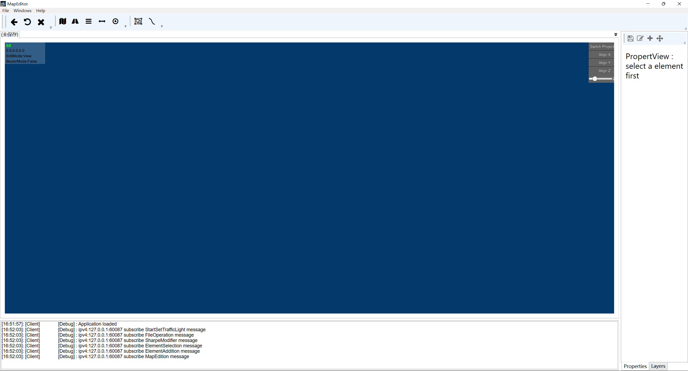
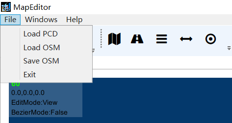
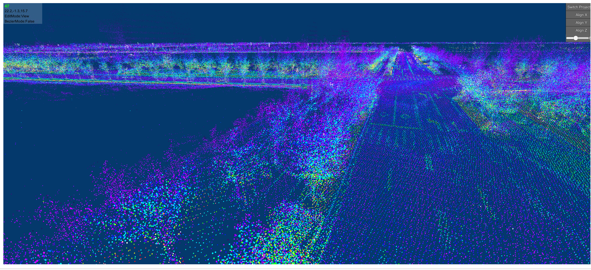
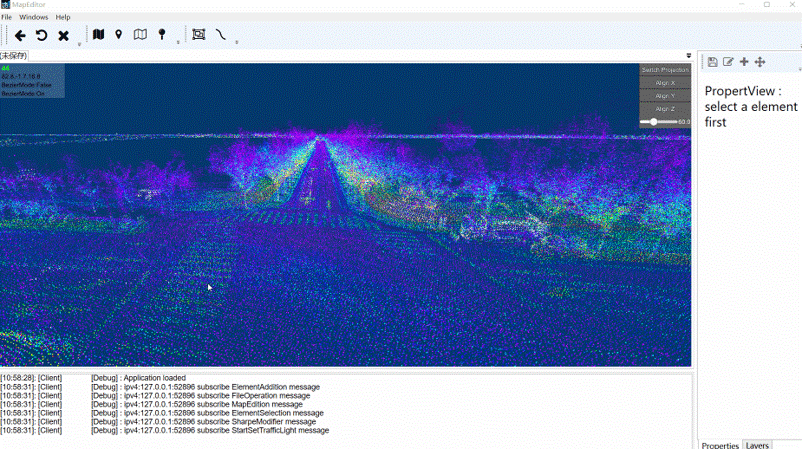
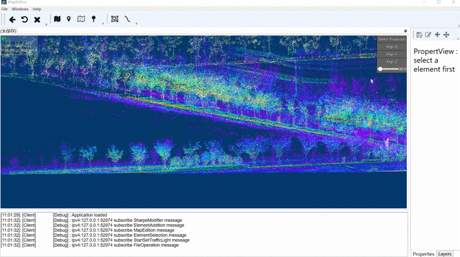
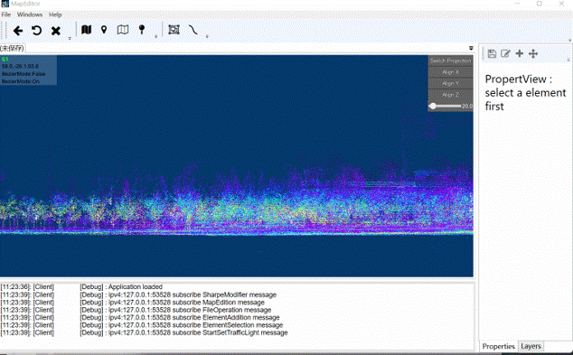
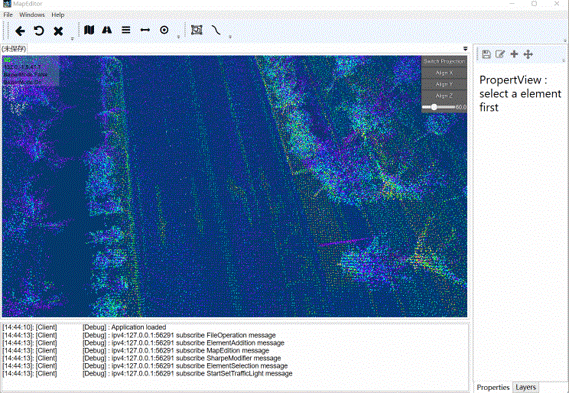

# MapEditor
you can edit vector map with this tool
## Requirements
OS：Windows 10  
CPU：5 2400 or better  
GPU:Gtx1050ti or better  
RAM:16GB RAM  
DISK:1GB  
## how to use
### 1.Download MapEditor
### 2.launch MapEditor

### 3.Import PCD file
Click File-LoadPCD to import your PCD file  

### 4.Import VectorMap
Click File-LoadOSM to Import your osm file
### 5.Camera Operate
WASW - Move Camera  
QE - Lifting Camera  
Press and hold the right button - Rotate Camera  
F - Focus on the target  
left Alt + mouse move -Quickly set distance to target  
Switch Projection-Switch Camera Mode  
Align X - Align the camera along the X axis at the target  
Align Y - Align the camera along the Y axis at the target  
Align Z - Align the camera along the Z axis at the target

### Add white line
1. Click add a white line or ctrl+1 to enter AddLineMode
2. Click in map to set line position
3. Enter BezierMode to edit Line with Bezier curve
   

### Add Road
1. Click Add a lanelet OR ctrl+0
2. Click in map to set lanelet positions
3. Enter BezierMode to edit Line with Bezier curve
4. Drag Bezier handle to Set the direction of the lanelet
5. Ctrl+W to extend the Selected Lanelet
6. Ctrl+D to Copy a Lanelet at right of Selected Lanelet

### Add TrafficLight
1. Click Add a TrafficLight or ctrl+3
2. Click to Set position of Trafficlight and then drag the leftPoint and rightPoint to Align trafficlights to right position

### Add StopLine
1. select two Point
2. Click Add a StopLine or ctrl+2
### Connect StopLine and TrafficLight
1. select a StopLine and a traffcLight
2. ctrl+4 to connect
### Save VectorMap
Click File-SaveOSM to set file path or ctrl+S to Save osm at path MapEditorRender\MapEditorRenderer_Data\StreamingAssets\osm.osm

